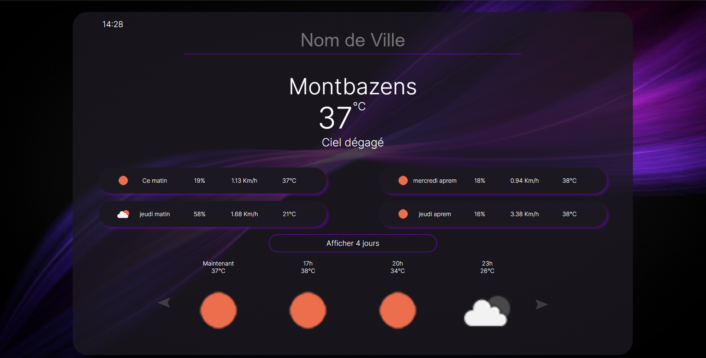

# Application Météo

L'**Application Météo** est une application simple et pratique qui fournit des informations météorologiques précises pour l'emplacement actuel de l'utilisateur. Elle utilise l'API d'OpenWeather pour récupérer les données météorologiques en temps réel et les affiche de manière conviviale pour que les utilisateurs puissent facilement planifier leurs activités en fonction des conditions météorologiques.

## Fonctionnalités

- Affichage de la météo actuelle pour la position géographique de l'utilisateur lors du chargement initial de la page.
- Prévisions météorologiques détaillées pour les 4 jours à venir.
- Mises à jour de la météo toutes les 2 heures pour les prochaines 24 heures, fournissant ainsi des informations précises à court terme.
- Géolocalisation automatique : l'application détecte automatiquement la position de l'utilisateur pour afficher les données météo locales.
- Utilisation de l'API OpenWeather : les données sont récupérées en temps réel depuis l'API OpenWeather, garantissant ainsi des informations à jour et fiables.

## Capture d'écran

## Crédits

- Données météorologiques fournies par [OpenWeather](https://openweathermap.org/).

## Auteur

Lenoir Yohan
